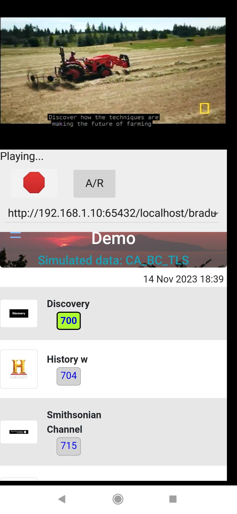
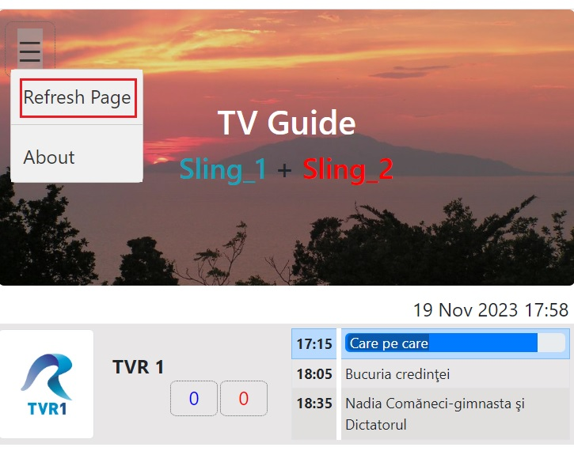

# TvGuide and SlingBox Channel Changer #

Web app with a TV Guide and means to change the channels in your SlingBox(ese).

It can work as a TV Guide, as a channel changer or as both, integrated with the [Slinger Player](https://github.com/GerryDazoo/SlingerPlayer) or independently of it.


&nbsp;&nbsp;&nbsp;

&nbsp;&nbsp;&nbsp; &nbsp;&nbsp;&nbsp; &nbsp;&nbsp;&nbsp; &nbsp;&nbsp;&nbsp; &nbsp;&nbsp;&nbsp;

&nbsp;&nbsp;&nbsp;  


TvGuide integrated with Slinger Player for Android and for Windows, as well as a standalone webpage (for TVs)<br />


## Table of Contents

- [Overview](#overview)
    - [TV Guide](#tv-guide)
    - [SlingBox channel changer](#slingbox-channel-changer)
  
- [Configuration](#configuration)
  
- [Functionality](#functionality)
    - [TV Guide functionality](#tv-guide-functionality)
    - [SlingBox channel changer functionality](#slingbox-channel-changer-functionality)

- [Getting Started](#getting-started)

- [Contributing](#contributing)

- [License](#license)

- [Credits](#credits)


## Overview

This app offers a convenient way to view programs info and select channels on your SlingBox(es).<br />
Such functionality, also referred as [interactive electronic program guide (IPG)](https://en.wikipedia.org/wiki/Electronic_program_guide) 
was originally provided by the SlingPlayer app (only for digital channels in USA and Canada) but the [service has been discontinued](https://www.slingbox.com/) as of 9 Nov.2022.<br />
Currently the most complete and robust solution to use SlingBoxes is the [open source project Slinger Server](https://github.com/GerryDazoo/Slinger/tree/main/CustomRemotes) 
which offers full control over SlingBoxes and provides complex remote controls.<br />
Therefore this app is not meant to replace but to complement these remote controls with IPG capability.<br />


Requirements:
- a data source that provides information about TV channels and programs
- a SlingBox Server Wrapper that controls the SlingBoxes.

These three components (TvGuide Web App, TvGuide Data Source and the SlingBox Server) 
can be located in the same machine or in different machines: in the same network or across the Internet.

<p style="text-align: center;">

<br />System Architecture - TvGuide Web App, TvGuide Data Source and SlingBox Server
</p>

<br />

### TV Guide
As a **TV Guide**, the app requires a data source that provides information about channels and programs. <br />
Such data source can be a WebAPI service  (_not provided here_)<br />

In this app, the TV Guide and the SlingBoxes channel changer functionalities are independent of each other, 
but when provided with channel numbers the TV Guide will display them as inactive/disabled buttons.

<br />

### SlingBox channel changer
As a **channel changer**, the data source can be:
- a WebAPI service with channels and programs data,
- static JSON files with channels data and (empty) programs data.

It must have access my [SlingBox Server Wrapper](#) which, in turn, talks to Gerry Dazoo's [Slinger Server](https://github.com/GerryDazoo/Slinger)
which controls the SlingBoxes.<br />
It may be integrated with the [Slinger Player](https://github.com/GerryDazoo/SlingerPlayer) app 
that is used to display the video stream.<br />
Besides Slinger Player, the app can be launched independently in a browser, 
usually when being used as a remote control for Smart TVs which stream from SlingBoxes via [VLC](https://www.videolan.org/).<br />

<br />

## Configuration
Configure the app by modifying the files in the `config\` sub-directory.<br />

   - Indicate the environment type in the file `config\environment.json`.<br />
   Configure the data source by indicating the environment type (`development`, `production`, etc.) in the file `config\environment.json`.<br />
In the following example, the environment is `mockdata_1_sling`:
```json
 {
   "environment": "mockdata_1_sling",
   "_suggested_values": "development, mockdata_3_slings, mockdata_2_slings, mockdata_1_sling, mockdata_0_slings, mock_CA_BC_TLS, staging, production"
  }
 ```
In the example above where the environment is `mockdata_1_slings`, the webpage
will read the default settings in the file `config\appsettings.json`,
and then the the URLs to the data source from file `config\appsettings.mockdata_1_slings.json`.<br />

(See the explanations in the [Configuration](./Docs/Configuration.md) file.)

The app comes pre-loaded with a few mock data sources that can be used for testing purposes or instead of a real data source.<br />
- mockdata_0_slings: 0 SlingBoxes, 6 channels, 3 programs
- mockdata_1_sling: 1 SlingBox, 6 channels, 3 programs
- mockdata_2_slings: 2 SlingBoxes, 6 channels, 3 programs
- mockdata_3_slings: 3 SlingBoxes, 6 channels, 3 programs
- mock_CA_BC_TLS: 1 SlingBox, 10 channels, 0 programs
(simulates a cable provider in British Columbia, Canada)

IMPORTANT: To use these mock data sources to change channels, you have to modify the SlingBox names in the file `data\tvchannel_[...].json` 
to match the names of your SlingBoxes declared in the Slinger project on your computer, in the file `config.ini` or `unified_config.ini`.<br />
(The SlingBox names in the config.ini can be different from the names of the SlingBox devices).<br />

<p style="text-align: center;">
<br>
Using static data to enable channel changing (no program info available)
</p>

Therefore, by using mock data instead of a real-time data source, you can still 
use the app as a channel changer.


See more details in the [Configuration](./Docs/Configuration.md) file.

Note: when changing the configuration files, you need to restart the app from the menu in order to apply the changes:<br /> 
<p style="text-align: center;">
<br/>
Refresh the page to apply the changes

</p>

## Functionality
The app reads TV Guide info from data source via the URLs indicated in the configuration file.<br />
When its URL contains certain parameters which indicate the presence of SlingBox server Wrapper, 
the app will use them to change the channels in the SlingBox(es).<br />


### TV Guide functionality

The app, upon launch, will read the data from the data source and will cache some of it.<br />
The TV Guide data source must provide the following information:

* **1.1. Date & Time at the TV Station location**<br />
  Utilized to display the TV programs adjusted to the local time of the device which browse the TV Guide.<br />


* **1.2. TV Channels**<br />
  Utilized to display the TV channels and, optionally, the channel numbers of the slingBoxes that stream them <br />
**Important:**  the name of the slingBox is provided by the data source, and should be the same as the name of the slingBox in the Slinger Server.<br /> 


* **1.3. TV Programs**<br />
  The date-time of the TV programs corresponds to the local time of the TV Station.<br />
  The app will adjust the date-time of the TV programs to the local time of the device which browses the TV Guide.<br />

See more details in the [DataSource](./Docs/DataSource.md) file.

<br />

### SlingBox channel changer functionality

Channel changer functionality is provided by the SlingBox Server Wrapper:<br />
1. The Server pushes notifications to this app about the following streaming events of the SlingBoxes
   - `streaming in progress` 
   - `streaming stopped` 
   - `channel changed` 
   - `slingbox bricked`
   - `remote locked` <br />
2. The app reacts to these notifications by updating the UI accordingly.<br />
3. The app queries periodically the Server to receive an updated Server Status.<br />

To use the app as a channel changer, its URL needs two additional parameters:
1. the Slinger Server URL.
2. the SlingBox Server Wrapper URL. 

**What are the Slinger Server and the SlingBox Server Wrapper?**<br />
- The **Slinger Server**, as mentioned already, is the server that controls the SlingBoxes. 
  It is created by Gerry Dazoo and is available on GitHub at the address indicated above.<br />
- The **SlingBox Server Wrapper** is a bridge between the Slinger Server and the web page of the TvGuide app.<br />
  It "wraps" the Slinger Server and provides
  - a REST API to it:
    - to send to the Slinger Server the channel change commands received from TV Guide app 
    - to send to the app information about the SlingBoxes status
  - a **SignalR** connection to the web page of the TvGuide app, which notifies the web page  
about changes in SlingBoxes' status.<br />

See more details in the [SignalR_Data_Notifications](./Docs/SignalR_Data_Notifications.md) file.

Reminder: You need to ensure **exact match** between the slingBox name in the data source and the slingBox name in the Slinger Server.<br />
<br />  

#### 2.1. How does the app work as a channel changer?

The Wrapper server notifies the web page whenever a SlingBox status changes.<br />
 - If the SlingBox is streaming, the web page will display:
   - the channel numbers as selectable/clickable buttons, 
   - the selected channel highlighted.
 <br />


 - If the SlingBox stops streaming, the Wrapper server should send a `streaming stopped` notification 
to the web page, which, in turn, will display the channel numbers as inactive buttons.<br />

When the user clicks on a channel number, the web page will send a channel change command to the SlingBox Server Wrapper.<br />

# Getting Started
1. Create a website (IIS, Apache, etc.) on a web server and copy there the files from this GitHub repo.<br />
   (As web server you may use the same machine as the SlingBox Server or a different one.)<br />
   When the website is located on the Internet, make sure that the SlingBox server can be accessed via an IPV4 address or a DNS.<br />

2. Configure the app by modifying the files in the `config\` sub-directory.<br />
   See more details above in the [Configuration](#how-is-the-app-using-the-configuration-files) paragraph.

3. Configure the SlingBox Server Wrapper.<br />
   See more details in its GitHub repo [SlingBox Server Wrapper](#).

4. Launch the app: 
   - directly in a browser by using its URL.<br />
   - from a Slinger Player app, after its modifying remote control web page to reference the URL of the app.<br />


# Contributing
Contributions are welcome!<br />

If you want to contribute, please contact me first to discuss the changes.<br />

I prefer to keep this code as simple as possible, JavaScript only (no transpilers - React, Angular, etc.)
so that it can be easily understood and modified.<br />

BTW: I am not a JavaScript developer, so I am open to suggestions on how to improve the code.<br />

This is a personal project, and I don't have a lot of time to work on it.<br />

# License
This project is licensed under the MIT License - see the [LICENSE](./Docs/License.md) file for details

# Credits
- [SlingBox by Sling Media](https://en.wikipedia.org/wiki/Slingbox) - the device that streams TV channels over the Internet
- [Slinger Server by Gerry Dazoo](https://github.com/GerryDazoo/Slinger) - the server that controls the SlingBoxes, created by Gerry Dazoo
- [Slinger Player by Gerry Dazoo](https://github.com/GerryDazoo/SlingerPlayer) - the player that displays the video stream from the SlingBoxes, created by Gerry Dazoo
- [ChatGPT3 by OpenAI](https://chat.openai.com/) - used to generate code, documentation and proofread this Readme file

- [CloudConvert](https://cloudconvert.com/mp4-to-gif) - used to create animated GIFs from videos.
- [Draw.io](https://app.diagrams.net/) - used to create diagrams
